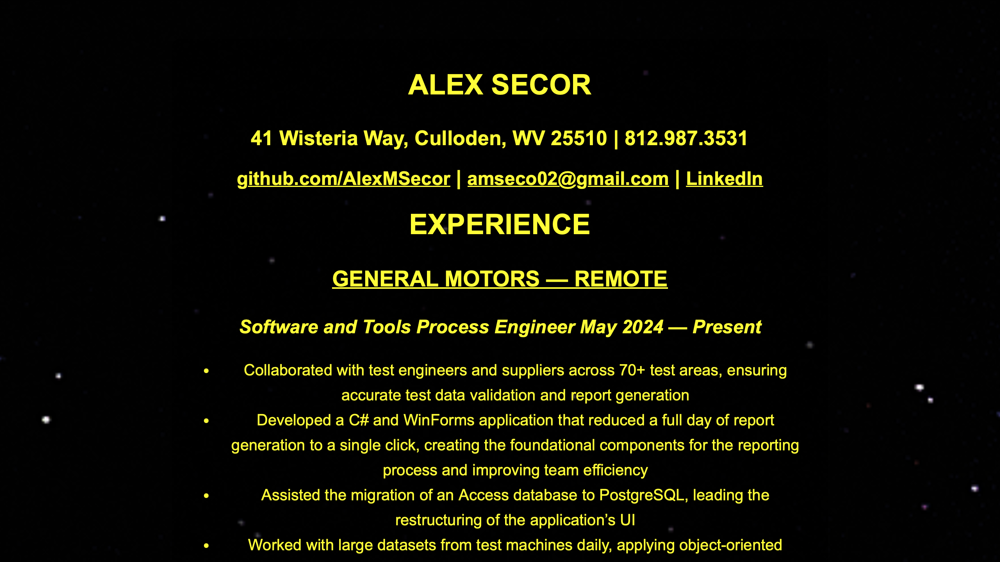

# Thematic Resume

A JavaScript application that displays my resume with different themes each time the user refreshes the page.

The idea came from a website I saw, where the same story was themed differently with each page refresh. I really liked that concept and thought it would be awesome to try it myself.

This is my ***first-ever*** JavaScript program. I thought it would be a perfect way to learn JavaScript while also showcasing my creative side. I really enjoy front-end development, so this project scratches that itch.

If I were to start over, I would format my resume differently so that it displays exactly the way I want on the server. I had to compromise the look in some areas because I wanted to use the exact resume I’ll be submitting, without any changes.

I didn't want to spend too much time on this project, just enough to prove that I could complete the idea. Overall, I’m happy with how it turned out. I’d like to dive deeper into JavaScript in the future and maybe revisit this project.

### Star Wars (Space) Theme Screenshot:

